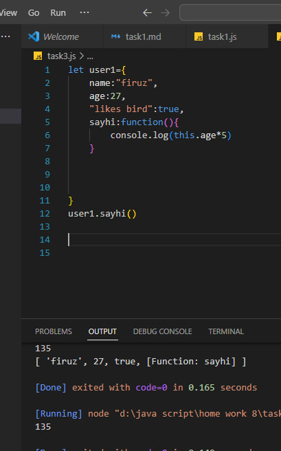

#
ОбЪекты (object) в java script

###
Как мы знаем из главы Типы данных, в JavaScript существует 8 типов данных. Семь из них называются «примитивными», так как содержат только одно значение (будь то строка, число или что-то другое).

Объекты же используются для хранения коллекций различных значений и более сложных сущностей. В JavaScript объекты используются очень часто, это одна из основ языка. Поэтому мы должны понять их, прежде чем углубляться куда-либо ещё.

Объект может быть создан с помощью фигурных скобок {…} с необязательным списком свойств. Свойство – это пара «ключ: значение», где ключ – это строка (также называемая «именем свойства»), а значение может быть чем угодно.

Мы можем представить объект в виде ящика с подписанными папками. Каждый элемент данных хранится в своей папке, на которой написан ключ. По ключу папку легко найти, удалить или добавить в неё что-либо.
#

###
Пустой объект («пустой ящик») можно создать, используя один из двух вариантов синтаксиса:
#

#

###
Обычно используют вариант с фигурными скобками {...}. Такое объявление называют литералом объекта или литеральной нотацией.

Литералы и свойства
При использовании литерального синтаксиса {...} мы сразу можем поместить в объект несколько свойств в виде пар «ключ: значение»:
#

###
У каждого свойства есть ключ (также называемый «имя» или «идентификатор»). После имени свойства следует двоеточие ":", и затем указывается значение свойства. Если в объекте несколько свойств, то они перечисляются через запятую.

В объекте user сейчас находятся два свойства:

Первое свойство с именем "name" и значением "Firuz".
Второе свойство с именем "age" и значением 27.
Можно сказать, что наш объект user – это ящик с двумя папками, подписанными «name» и «age».
#

###
Мы можем в любой момент добавить в него новые папки, удалить папки или прочитать содержимое любой папки.

Для обращения к свойствам используется запись «через точку»:
Значение может быть любого типа. Давайте добавим свойство с логическим значением:
#

#

###
Для удаления свойства мы можем использовать оператор delete:
#

#

###
Имя свойства может состоять из нескольких слов, но тогда оно должно быть заключено в кавычки:
#

###
Последнее свойство объекта может заканчиваться запятой:
##
Квадратные скобки
###
Для свойств, имена которых состоят из нескольких слов, доступ к значению «через точку» не работает:
#

###
JavaScript видит, что мы обращаемся к свойству user.likes, а затем идёт непонятное слово birds. В итоге синтаксическая ошибка.

Точка требует, чтобы ключ был именован по правилам именования переменных. То есть не имел пробелов, не начинался с цифры и не содержал специальные символы, кроме $ и _.

Для таких случаев существует альтернативный способ доступа к свойствам через квадратные скобки. Такой способ сработает с любым именем свойства:
#

###
мотоды в object
Object.entries()
метод энтрайс выводит объекты в масиве
#

###
т.е кажду пару (ключ значение) в обЪекте преобразует в массив
###
object.keys()-этод метод выводит только ключи в образе массива
#

###
Object. values()-Выводит только значения в образе массива 
#

##
Что такое destruction(деструктуризация ) и spread в мвссиве
###
Деструктуризация (destructuring assignment) – это особый синтаксис присваивания, при котором можно присвоить массив или объект сразу нескольким переменным, разбив его на части.
Пример деструктуризации массива:
#

###

###
как мы видем на каритинке когда необходима копия нашего элемента то мы пользуемся методом деструктуризации и пользуемся синтаксисом let user1={...user} т.е мы сохраняем в новую переменную коппию первого объекта!
##
Что такое keyword в js
###
JavaScript (Стандарт ЕСМА-262) определяет набор ключевых слов (keywords), служащих для решения специализированных задач, таких как указание начала или конца управляющей инструкции или выполнение специфической операции. Ключевые слова нельзя использовать как идентификаторы и имена свойств. Вот их полный список (ключевое слово со звездочкой было добавлено в пятой редакции).
в этой теме мы поговорим о ключевом слове this
зачем оно нам
Значение this – это объект «перед точкой», который используется для вызова метода.
#

###
как мы видим на кртинке значени 135, так откуда оно унас появилась ?
дело в том что метод this указал нам на дркугой кей который находится в функции и таким образом в функция seyhi выполнилась ссылаясь на значение age который мы указазали!!!
##
DATA AND TIME
###
Дата и время представлены в JavaScript одним объектом: Date. Создать «только время» при этом нельзя, оно должно быть с датой. Список методов
#

###
как мы видим на картинке что дата отдельно отвремени не работает
Метод Date.now()
Метод Date.now() возвращает дату сразу в виде миллисекунд.

Технически, он аналогичен вызову +new Date(), но в отличие от него не создаёт промежуточный объект даты, а поэтому – во много раз быстрее.

Его использование особенно рекомендуется там, где производительность при работе с датами критична. Обычно это не на веб-страницах, а, к примеру, в разработке игр на JavaScript.

Итого
Дата и время представлены в JavaScript одним объектом: Date. Создать «только время» при этом нельзя, оно должно быть с датой. Список методов Date мы рассмотрим дальше
Отсчёт месяцев начинается с нуля.
Отсчёт дней недели (для getDay()) тоже начинается с нуля (и это воскресенье).
Объект Date удобен тем, что автокорректируется. Благодаря этому легко сдвигать даты.
При преобразовании к числу объект Date даёт количество миллисекунд, прошедших с 1 января 1970 UTC. Побочное следствие – даты можно вычитать, результатом будет разница в миллисекундах.
Для получения текущей даты в миллисекундах лучше использовать Date.now(), чтобы не создавать лишний объект Date (кроме IE8-)
Для бенчмаркинга лучше использовать performance.now() (кроме IE9-), он в 1000 раз точнее.
в элементе дата сначала идет год потом месяц потом день потом час потом минуты и секунды а последнее милисикунды
###
Есть 4 метода для создания даты
1 new date()
2 new Dare(milleseconds)
3 new Date(string)
4 new Date(год.месяц.день.час.минуты.секунды.милисекунды)

Вы можете создать дату с методом new Date как показано на примере 
#

###
в джаве скрипт дата набирает отсчет от 1 января 1970 года 00 чаосв 00секунд 00 милисекунд прибавляя мили секунды она составляет дату на этот момент
###
new Data(string) то сего вы указываете и это он дополняет остальными частями дата по умолчанию а по умолчанию всё остальное начинается с первого месяца первого дня с 00 часов и т.д как показано на картинке
#

###
 в методе new date(год месяц день минуты секуды мили секунды)
если вы не указали все элементы то они дополняются специфическими цифрами
#

###
но если вы укажите один аргумент то джава скр подсчитает его как милисекунды и прибавит к начальной дате 1970 года
## методы в с обЪектом date 
###
Для доступа к компонентам даты-времени объекта Date используются следующие методы:

getFullYear()
Получить год (из 4 цифр)
getMonth()
Получить месяц, от 0 до 11.
getDate()
Получить число месяца, от 1 до 31.
getHours(), getMinutes(), getSeconds(), getMilliseconds()
Получить соответствующие компоненты.
Все методы, указанные выше, возвращают результат для местной временной зоны.

Существуют также UTC-варианты этих методов, возвращающие день, месяц, год и т.п. для зоны GMT+0 (UTC): getUTCFullYear(), getUTCMonth(), getUTCDay(). То есть, сразу после "get" вставляется "UTC".

Если ваше локальное время сдвинуто относительно UTC, то следующий код покажет разные часы:
Кроме описанных выше, существуют два специальных метода без UTC-варианта:

getTime()
Возвращает число миллисекунд, прошедших с 1 января 1970 года GMT+0, то есть того же вида, который используется в конструкторе new Date(milliseconds).

getTimezoneOffset()
Возвращает разницу между местным и UTC-временем, в минутах.
Установка компонентов даты
Следующие методы позволяют устанавливать компоненты даты и времени:

setFullYear(year [, month, date])
setMonth(month [, date])
setDate(date)
setHours(hour [, min, sec, ms])
setMinutes(min [, sec, ms])
setSeconds(sec [, ms])
setMilliseconds(ms)
setTime(milliseconds) (устанавливает всю дату по миллисекундам с 01.01.1970 UTC)
Все они, кроме setTime(), обладают также UTC-вариантом, например: setUTCHours().
 